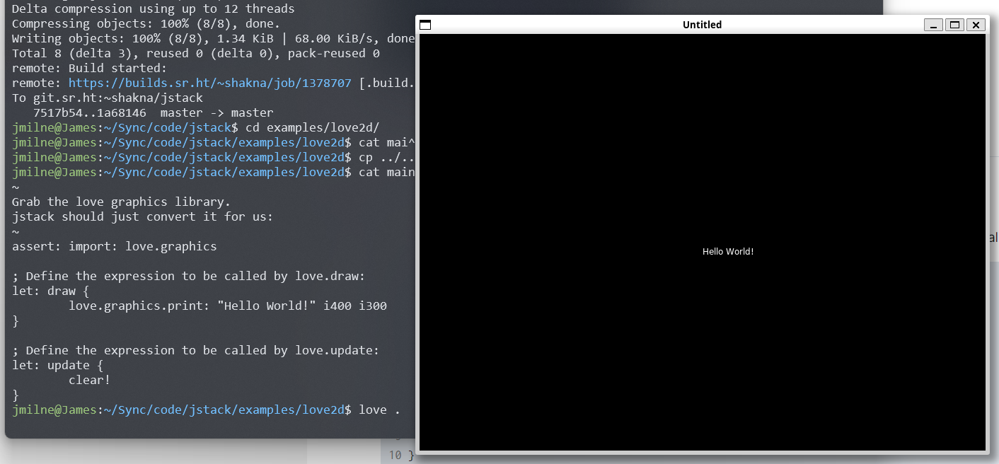

# love2d Example

Whilst `jstack` will work perfectly well under [love2d](https://love2d.org/), we do need a tiny bit of Lua tro trigger the load.

The [main.lua](main.lua) loads in `jstack`, and our script to execute.

The [main.stk](main.stk) file demonstrates actually controlling love2d.

You'll just need to add `jstack.lua` to the same directory.
